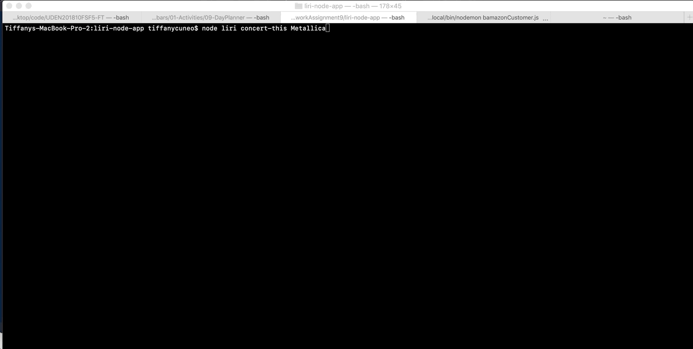
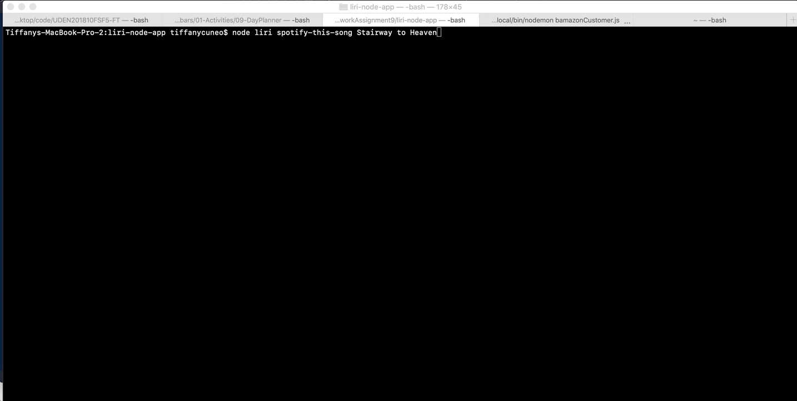
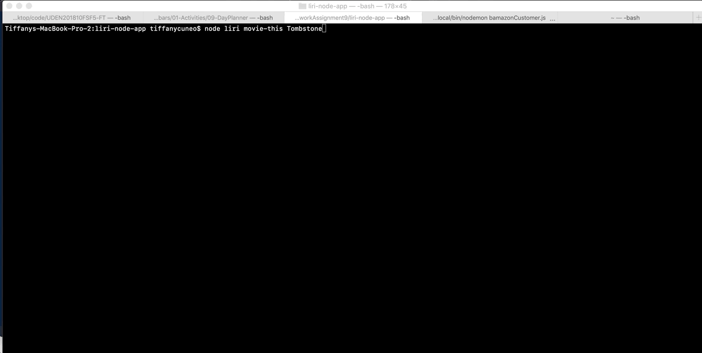
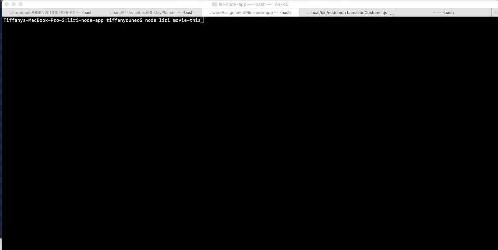

# LIRI-Bot

 ## LIRI is a Language Interpretation and Recognition Interface. LIRI is a command line node app that takes in parameters and gives you back data. LIRI will search Spotify for songs, Bands in Town for concerts, and OMDB for movies.

1. Type this command in node: node liri.js concert-this <artist/band name here>

2. Type this command in node: node liri.js spotify-this-song '<song name here>'

3. Type this command in node: node liri.js movie-this '<movie name here>'

4. Type this command in node: node liri.js do-what-it-says

5. Type this command in node: node spotify-this-song 

6. Type this command in node: node movie-this

7. log.txt

